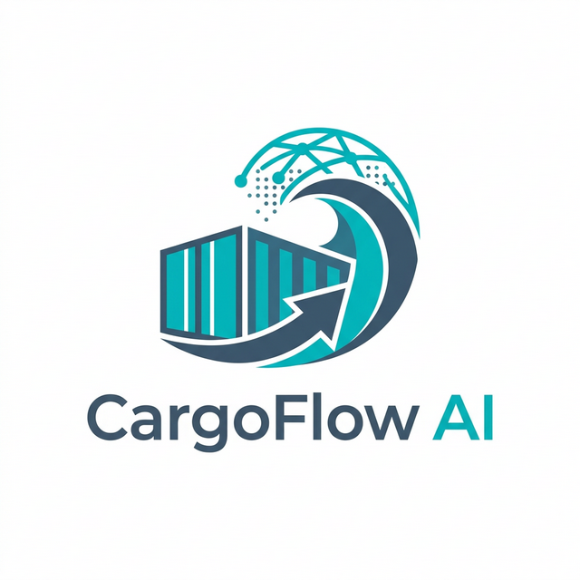

# CargoFlow AI

CargoFlow AI is an intelligent Logistic Data Processing (IDP) web application tailored for the supply chain and freight forwarding industry. It uses the state-of-the-art **Google Gemini 2.5 Flash** AI model and a highly specific extraction schema to perfectly parse complex shipping invoices into structured data formats, with a huge emphasis on 100% line-item accuracy.



## Overview

Processing freight invoices traditionally involves tedious manual data entry. CargoFlow AI solves this by allowing users to simply drag and drop PDFs or images. The application streams the file securely to Gemini with a highly optimized prompt engineered to extract every detail—especially deep arrays like the charges tables containing quantities, rates, basis codes, and final amounts.

**Core Capabilities:**
- **In-memory Document Parsing:** Handles `.pdf`, `.png`, `.jpg`, and `.webp` invoices natively.
- **Flawless Line Item Context:** Eliminates generic extraction faults by differentiating shipping line descriptions from general cargo/commodity descriptions.
- **Asynchronous Processing:** Powered by Flask-SocketIO to stream progress and status updates to the UI in real-time.
- **Local Persistence:** All extractions are automatically saved as JSON models natively to the host system (`/saved_invoices`).
- **Responsive Dashboard:** A sleek, glassmorphism-inspired "Light Mode" UI that features a dynamic overview dashboard, file previews, and an intricate modal viewer for data review.

## Tech Stack
- **Backend:** Python, Flask, Flask-SocketIO (Eventlet)
- **AI Core:** Google Generative AI SDK (`gemini-2.5-flash`)
- **Frontend:** Vanilla JavaScript, CSS Grid/Flexbox, Socket.io Client, Lucide Icons

## Setup & Run Locally

### 1. Prerequisites
- Python 3.8+
- Active Google Gemini API Key

### 2. Installation
Clone the repository and install the backend modules inside a virtual environment.
```bash
git clone https://github.com/sreeharivponline/cargoflow-ai-invoice.git
cd cargoflow-ai-invoice

# Create a virtual environment
python3 -m venv venv
source venv/bin/activate

# Install requirements (make sure you have flask, flask-socketio, eventlet, google-generativeai, python-dotenv)
pip install flask flask-socketio eventlet google-generativeai python-dotenv
```

### 3. Environment Variables
Create a `.env` file at the root of the project to store your secret Gemini API key:
```env
GEMINI_API_KEY="your-gemini-key-goes-here"
```

### 4. Start the Application
Boot the Eventlet Flask web server:
```bash
python app.py
```
Open your web browser and navigate to `http://localhost:5000/`.

## Application Architecture

- **`app.py`**: The core application engine. Manages WebSocket connections, handles the AI Prompt composition, connects to the Gemini REST API, and parses the returned JSON string into Python dictionaries. It also manages saving files to the hard disk.
- **`templates/index.html`**: The entire multi-view application interface structure.
- **`static/script.js`**: Handles file encoding, drag-and-drop logistics, asynchronous SocketIO listeners, modal toggling, dynamic dashboard rendering, and view routing.
- **`static/style.css`**: Manages all the aesthetics including animations, glass effects, flex grids, list styling, colors, and responsive sizing bounds.

## License
MIT License
